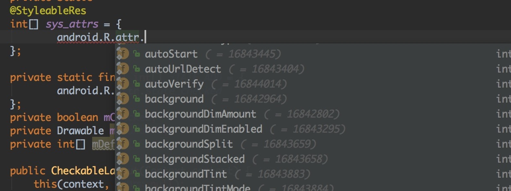
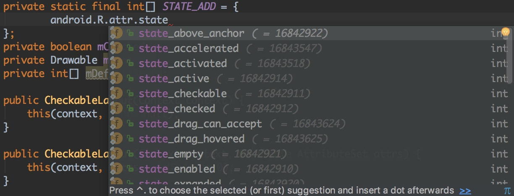
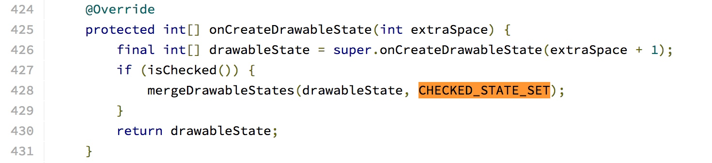
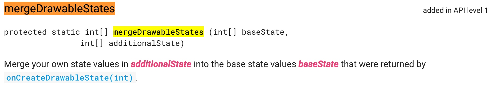
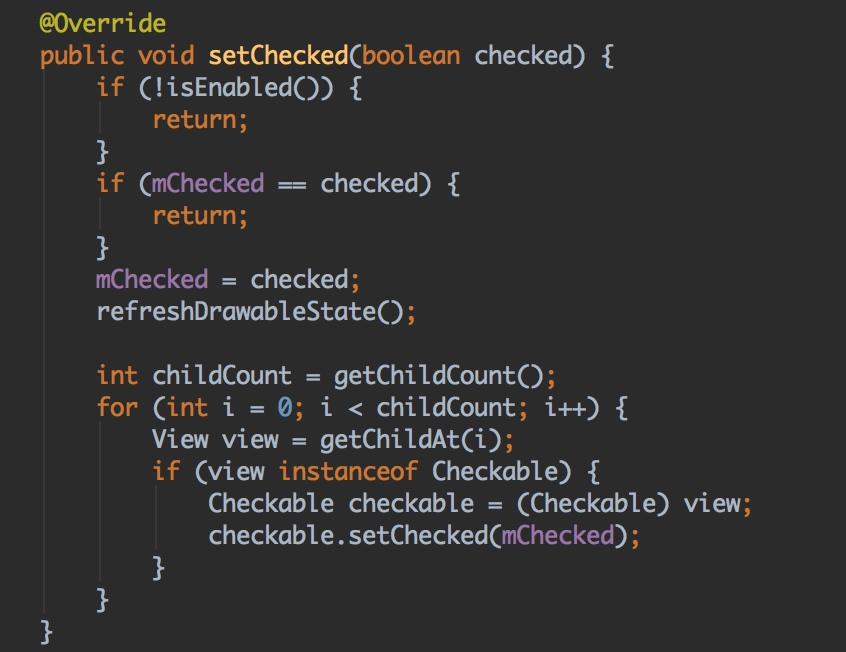
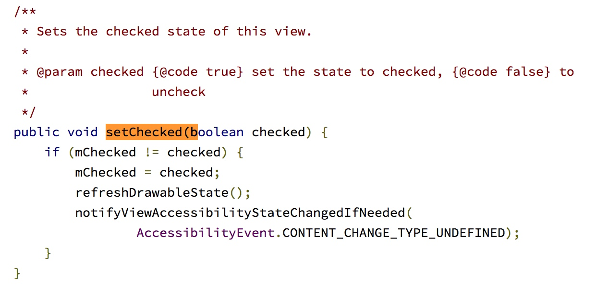

## 需求背景
主要是有业务需求的前提下，尽量不要做可以避免的硬编码，以防后续更改时挖下巨坑。
经常会在需求上遇到有对一个view(ViewGroup)做状态变更，ui状态改变
如果是单个View,是可以考虑直接使用系统控件去实现效果

```
例如 
RadioButton
RadioGroup
CheckedTextView
...
```
在满足比较常见的效果外，我们还会考虑如果是更为复杂的组合控件，甚至可能要考虑多种状态
CheckedTextView 能不能再添加一种新的状态呢，这确实是一个非常有意思的事情呢
## 添加新状态
### 支持新状态的属性（类型？）
先看下有哪些类型的属性是支持添加新状态的。
哈哈，皮了一下。
其实是绝大多数类型的属性都是支持的

```
    android:background
    android:text
    android:textColor
    ...    
```
以上对应系统定义的属性

```
     android.R.attr.background
     ...
```

### 支持哪些新状态
这些新状态的新是指本来不支持的状态


### 如何添加新状态
例如TextView 本来是不支持state_checked 状态，添加了新状态后就是CheckedTextView
这个时候不得不去看下CheckedTextView 是如何添加的state_checked状态了
刚打开就看到这么一行代码，好像就是我们要添加的新状态（state_checked）


那么继续往下看，是哪里使用到这里的状态

这里大致解释一下，
extraSpace+1 是表示添加一种状态，个人觉得，是不是用上边的set.size()替换更合适呢，当然在这里明显知道是只添加一种状态，感觉还可以接受啦。
mergeDrawableStatus是View的方法，先看下怎么解释这个方法的

这个很好理解，就是在原来的基础上添加新的状态，并且最终添加后的状态是在
onCreateDrawableState方法的返回对象中体现
说到这里，基本就是一些核心方法了，
接下来就是处理对状态样式的处理


上图为一个ViewGroup在处理state_checked状态时的操作，也需要对子View担当起相应的义务哦~。
如果是CheckedTextView相对TextView添加的state_checked状态，反而没那么复杂.如下



