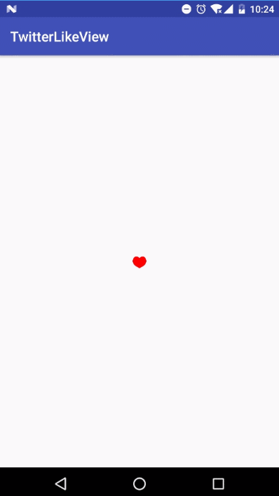

# 点赞效果(仿Twitter)

## 背景

> 酷炫的点赞效果

## 效果演示



## 示例代码

```java
package com.wangx.library;

import android.animation.ValueAnimator;
import android.content.Context;
import android.graphics.Bitmap;
import android.graphics.Canvas;
import android.graphics.Color;
import android.graphics.Paint;
import android.graphics.Path;
import android.graphics.PointF;
import android.graphics.RectF;
import android.support.annotation.Nullable;
import android.util.AttributeSet;
import android.util.TypedValue;
import android.view.View;

import static com.wangx.library.LikeView.WitchOne.DOT_HEART;


/**
 * @Author: xujie.wang
 * @Email: xujie.wang@17zuoye.com
 * @Date: 2017/6/7
 * @Project: TwitterLikeView
 */

public class LikeView extends View implements View.OnClickListener {
    /**
     * Bézier曲线画圆的近似常数
     */
    private static final float c = 0.551915024494f;
    private float defaultSize = 100.0f;
    //    private int mCycleRadius;
    private Paint mPaint;
    private float mOffset;
    private PointF tPointA;
    private PointF tPointB;
    private PointF tPointC;
    private PointF rPointA;
    private PointF rPointB;
    private PointF rPointC;
    private PointF bPointA;
    private PointF bPointB;
    private PointF bPointC;
    private PointF lPointA;
    private PointF lPointB;
    private PointF lPointC;
    private int mCenterX;
    private int mCenterY;
    private float mRadius;
    private float mCurrentRadius;
    private float ringPercent;
    private WitchOne mWitchOne = WitchOne.HEART;

    private float dotR;
    private float offS;
    private float offL;
    private float rDotS;
    private float rDotL;
    private int mWidth;
    private int mHeight;
    private boolean isMax;

    public LikeView(Context context) {
        this(context, null);
    }

    public LikeView(Context context, @Nullable AttributeSet attrs) {
        this(context, attrs, 0);
    }

    public LikeView(Context context, @Nullable AttributeSet attrs, int defStyleAttr) {
        super(context, attrs, defStyleAttr);
        defaultSize = applyToDip(defaultSize);
        System.out.println("defaultSize = " + defaultSize);
        initPaint();
        setOnClickListener(this);
    }

    private void initPaint() {
        mPaint = new Paint(Paint.ANTI_ALIAS_FLAG);
        mPaint.setColor(Color.parseColor("#ff00ff"));
        mPaint.setStrokeCap(Paint.Cap.ROUND);
    }

    public float applyToDip(float value) {
        return TypedValue.applyDimension(TypedValue.COMPLEX_UNIT_DIP, value, getResources().getDisplayMetrics());
    }

    @Override
    protected void onMeasure(int widthMeasureSpec, int heightMeasureSpec) {

        mRadius = applyToDip(10);
        dotR = mCurrentRadius / 6;
        mWidth = (int) (5.2 * mRadius + 2 * dotR);
        mHeight = (int) (5.2 * mRadius + 2 * dotR);
        setMeasuredDimension(mWidth, mHeight);
//        mCycleRadius = (int) (size * 0.2f + 0.5f);
        //最大半径
//        mRadius = size * 0.3f + 0.5f;
        mCurrentRadius = mRadius;
    }

    @Override
    protected void onSizeChanged(int w, int h, int oldw, int oldh) {
        super.onSizeChanged(w, h, oldw, oldh);
        mCenterX = (int) (w * 0.5f);
        mCenterY = (int) (h * 0.5f);
    }

    @Override
    protected void onDraw(Canvas canvas) {
        super.onDraw(canvas);
        //移动圆心
        canvas.translate(mCenterX, mCenterY);
        if (mWitchOne == WitchOne.HEART) {
            // heart
            Bitmap bitmap = drawHeart();
            canvas.drawBitmap(bitmap, -mCenterX, -mCenterY, mPaint);
        } else if (mWitchOne == WitchOne.RING) {
            Bitmap ringBitmap = drawRing();
            canvas.drawBitmap(ringBitmap, -mCenterX, -mCenterY, mPaint);
        } else if (mWitchOne == WitchOne.CYCLE) {
            Bitmap cycleBitmap = drawCycle();
            canvas.drawBitmap(cycleBitmap, -mCenterX, -mCenterY, mPaint);
        } else if (mWitchOne == WitchOne.RING_HEART) {
            Bitmap CycleRingDotBitmap = drawCycleRingDot();
            canvas.drawBitmap(CycleRingDotBitmap, -mCenterX, -mCenterY, mPaint);
        } else if (mWitchOne == DOT_HEART) {
            Bitmap dotBitmap = drawDot();
            canvas.drawBitmap(dotBitmap, -mCenterX, -mCenterY, mPaint);
        }
    }

    private Bitmap drawCycleRingDot() {
        Bitmap bitmap = Bitmap.createBitmap(getMeasuredWidth(), getMeasuredHeight(), Bitmap.Config.ARGB_8888);
        Canvas canvas = new Canvas(bitmap);
        canvas.translate(mCenterX, mCenterY);
        Paint paint = new Paint(Paint.ANTI_ALIAS_FLAG);
        paint.setStyle(Paint.Style.STROKE);
        paint.setColor(Color.YELLOW);
        if (ringPercent <= 1) {
            RectF rectF = new RectF(-mCurrentRadius, -mCurrentRadius, mCurrentRadius, mCurrentRadius);
            canvas.drawArc(rectF, 0, 360, false, paint);
//            Bitmap ring = drawRing();
//            canvas.drawBitmap(ring, -mCenterX, -mCenterY, mPaint);
        }
        ringPercent = (1f - ringPercent > 1f ? 1f : 1f - ringPercent) * 0.2f;//用于计算圆环宽度，最小0，与动画进度负相关
        paint.setStrokeWidth(2 * mRadius * ringPercent);
        float innerR = mCurrentRadius - mRadius * ringPercent + dotR;
        double angleA = 0;
        double angleB = -Math.PI / 20;

        offS += dotR / 17;
        offL += dotR / 14;
        rDotS = mCurrentRadius - mRadius / 12 / 2 + offS;
        rDotL = innerR + offL;

        paint.setStyle(Paint.Style.FILL);
        for (int i = 0; i < 7; i++) {
            canvas.drawCircle((float) (rDotS * Math.sin(angleA)), (float) (rDotS * Math.cos(angleA)), dotR, paint);
            angleA += 2 * Math.PI / 7;
            canvas.drawCircle((float) (rDotL * Math.sin(angleB)), (float) (rDotL * Math.cos(angleB)), dotR, paint);
            angleB += 2 * Math.PI / 7;
        }
        mCurrentRadius = (int) (mRadius / 3 + offL * 4);
        Bitmap heart = drawHeart();
        canvas.drawBitmap(heart, -mCenterX, -mCenterY, paint);
        return bitmap;
    }

    private Bitmap drawCycle() {
        Bitmap bitmap = Bitmap.createBitmap(getMeasuredWidth(), getMeasuredHeight(), Bitmap.Config.ARGB_8888);
        Canvas canvas = new Canvas(bitmap);
        canvas.translate(mCenterX, mCenterY);
        Paint paint = new Paint(Paint.ANTI_ALIAS_FLAG);
        paint.setStyle(Paint.Style.FILL);
        paint.setColor(Color.RED);
        canvas.drawCircle(0, 0, mCurrentRadius, paint);
        return bitmap;
    }

    //绘制圆点、心形
    private Bitmap drawDot() {
        Bitmap bitmap = Bitmap.createBitmap(getMeasuredWidth(), getMeasuredHeight(), Bitmap.Config.ARGB_8888);
        Canvas canvas = new Canvas(bitmap);
        canvas.translate(mCenterX, mCenterY);
        Paint paint = new Paint(Paint.ANTI_ALIAS_FLAG);
        paint.setStyle(Paint.Style.FILL);
        paint.setColor(Color.RED);

        double angleA = 0;
        double angleB = -Math.PI / 20;
        float dotRS;
        float dotRL;
        if (rDotL < 2.6 * mRadius) {//限制圆点的扩散范围
            rDotS += dotR / 17;
            rDotL += dotR / 14;
        }
        if (!isMax && mCurrentRadius <= 1.1 * mRadius) {
            offL += dotR / 14;
            mCurrentRadius = (int) (mRadius / 3 + offL * 4);

        } else {
            isMax = true;
        }

        if (isMax && mCurrentRadius > mRadius) {
            mCurrentRadius = (int) (mCurrentRadius - dotR / 16);

        }
        Bitmap heart = drawHeart();
        canvas.drawBitmap(heart, -mCenterX, -mCenterY, paint);

        paint.setAlpha((int) (255 * (1 - ringPercent)));//圆点逐渐透明
        dotRS = (float) (dotR * (1 - ringPercent));
        dotRL = (float) (dotR * (1 - ringPercent) * 4) > dotR ? dotR : (float) (dotR * (1 - ringPercent) * 3);
        for (int i = 0; i < 7; i++) {
//            mPaint.setColor(dotColors[i]);
            canvas.drawCircle((float) (rDotS * Math.sin(angleA)), (float) (rDotS * Math.cos(angleA)), dotRS, paint);
            angleA += 2 * Math.PI / 7;
            canvas.drawCircle((float) (rDotL * Math.sin(angleB)), (float) (rDotL * Math.cos(angleB)), dotRL, paint);
            angleB += 2 * Math.PI / 7;
        }
        return bitmap;
    }

    /***
     * 绘制圆环
     * 外半径增加
     * 内半径增大
     * 外半径增大到一定程度后不再变化，内半径变化增大
     * @return
     */
    private Bitmap drawRing() {
        Bitmap bitmap = Bitmap.createBitmap(getMeasuredWidth(), getMeasuredHeight(), Bitmap.Config.ARGB_8888);
        Canvas canvas = new Canvas(bitmap);
        canvas.translate(mCenterX, mCenterY);
        Paint paint = new Paint(Paint.ANTI_ALIAS_FLAG);
        paint.setStyle(Paint.Style.STROKE);
        float strokeWidth = 2 * mCurrentRadius * ringPercent;
        paint.setStrokeWidth(strokeWidth);
        paint.setColor(Color.RED);
//        float offset = strokeWidth * 0.5f;
        RectF rectF = new RectF(-mCurrentRadius,
                -mCurrentRadius,
                mCurrentRadius,
                mCurrentRadius);
        canvas.drawArc(rectF, 0, 360, false, paint);
        return bitmap;
    }

    private Bitmap drawHeart() {
        initControlPoints(mCurrentRadius);
        Bitmap bitmap = Bitmap.createBitmap(getMeasuredWidth(), getMeasuredHeight(), Bitmap.Config.ARGB_8888);
        Canvas canvas = new Canvas(bitmap);
        canvas.translate(mCenterX, mCenterY);
        Path path = new Path();
        path.moveTo(tPointB.x, tPointB.y);
        path.cubicTo(tPointC.x, tPointC.y, rPointA.x, rPointA.y, rPointB.x, rPointB.y);
        path.cubicTo(rPointC.x, rPointC.y, bPointC.x, bPointC.y, bPointB.x, bPointB.y);
        path.cubicTo(bPointA.x, bPointA.y, lPointC.x, lPointC.y, lPointB.x, lPointB.y);
        path.cubicTo(lPointA.x, lPointA.y, tPointA.x, tPointA.y, tPointB.x, tPointB.y);
        Paint paint = new Paint(Paint.ANTI_ALIAS_FLAG);
        paint.setStrokeCap(Paint.Cap.ROUND);
        paint.setColor(Color.RED);
        canvas.drawPath(path, paint);
        return bitmap;
    }

    /**
     * 初始化Bézier 曲线四组控制点
     */
    private void initControlPoints(float mRadius) {
        mOffset = c * mRadius;

        tPointA = new PointF(-mOffset, -mRadius);
        tPointB = new PointF(0, -mRadius * 0.5f);
        tPointC = new PointF(mOffset, -mRadius);

        rPointA = new PointF(mRadius, -mOffset);
        rPointB = new PointF(mRadius, 0);
        rPointC = new PointF(mRadius * 0.9f, mOffset);

        bPointA = new PointF(-mOffset, mRadius * 0.7f);
        bPointB = new PointF(0, mRadius);
        bPointC = new PointF(mOffset, mRadius * 0.7f);

        lPointA = new PointF(-mRadius, -mOffset);
        lPointB = new PointF(-mRadius, 0);
        lPointC = new PointF(-mRadius * 0.9f, mOffset);
    }

    @Override
    public void onClick(View v) {
        startAnimation();
    }

    private void startAnimation() {
        resetState();
        ValueAnimator animator = ValueAnimator.ofFloat(0, 1200);
        animator.setDuration(2000);
        animator.addUpdateListener(new ValueAnimator.AnimatorUpdateListener() {
            @Override
            public void onAnimationUpdate(ValueAnimator animation) {
//                ringPercent = animation.getAnimatedFraction();

                Float animatedValue = (Float) animation.getAnimatedValue();
                if (animatedValue == 0) {

                } else if (animatedValue <= 100) {
                    //改变心形
                    float percent = calcPercent(0, 100, animatedValue);
                    mCurrentRadius = (1 - percent) * mRadius;
                    mWitchOne = WitchOne.HEART;
                    invalidate();
                } else if (animatedValue <= 280) {
                    float percent = calcPercent(100, 340, animatedValue);
//                    mRingCycleRadius = percent*mRadius;
                    mCurrentRadius = (int) (2 * mRadius * percent);
                    mWitchOne = WitchOne.CYCLE;
                    invalidate();
                } else if (animatedValue <= 340) {
                    // 半径较 圆半径增加
                    //这里圆环 要和圆相接 难搞
                    float percent = calcPercent(100, 340, animatedValue);
                    ringPercent = 1f - percent + 0.2f > 1f ? 1f : 1f - percent + 0.2f;//用于计算圆环宽度，最小0.2，与动画进度负相关
                    mCurrentRadius = (int) (2 * mRadius * percent);
                    mWitchOne = WitchOne.RING;
                    invalidate();
                } else if (animatedValue <= 480) {
                    float percent = calcPercent(340, 480, animatedValue);
                    ringPercent = percent;
                    mCurrentRadius = (int) (2 * mRadius);//外环半径不再改变
                    mWitchOne = WitchOne.RING_HEART;
                    invalidate();
                } else {
                    float percent = calcPercent(480f, 1200f, animatedValue);
                    ringPercent = percent;
                    mWitchOne = DOT_HEART;
                    invalidate();
                }
            }
        });
        animator.start();
    }

    private void resetState() {
        ringPercent = 0;
        mCurrentRadius = 0;
        isMax = false;
        rDotS = 0;
        rDotL = 0;
        offS = 0;
        offL = 0;
//        state = true;
//        mPaint.reset();
    }

    public float calcPercent(float start, float end, float current) {
        return (current - start) / (end - start);
    }


    public enum WitchOne {
        HEART, RING, CYCLE, RING_HEART, DOT_HEART
    }
}

```

