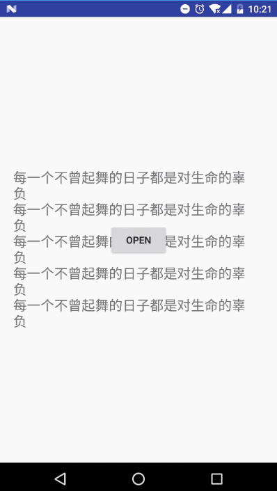

# CycleReveal

## 介绍

​	activity或者fragment切换时候的转场动画

## screenShot




## How to use:

使用最为便捷，使用`CyclepenLayout最为根节点即可`

```java

<com.wangx.activityanim.CycleOpenLayout
    xmlns:android="http://schemas.android.com/apk/res/android"
    android:id="@+id/ravel"
    android:layout_width="match_parent"
    android:layout_height="match_parent"
    android:background="#00ffffff">

    <TextView
        android:layout_width="match_parent"
        android:layout_height="48dp"
        android:background="#07d7c6"
        android:gravity="center_vertical"
        android:paddingLeft="16dp"
        android:text="显示内容"
        android:textSize="22sp"/>
</com.wangx.activityanim.CycleOpenLayout>
```

1. 启动动画

```java
  layout = ((CycleOpenLayout) findViewById(R.id.ravel));
  layout.start();
```

2. 退出动画

```java
 @Override
    public boolean onKeyDown(int keyCode, KeyEvent event) {
        if (keyCode == KeyEvent.KEYCODE_BACK) {

            layout.exit();
            return true;
        }
        return super.onKeyDown(keyCode, event);
    }
```

3. 动画结束后退出activity

```java
layout.setCallBack(new CycleOpenLayout.CallBack() {
            @Override
            public void onEnd() {
                finish();
                overridePendingTransition(0, 0);
            }

            @Override
            public void onStartComplete() {

            }
        });
```

> 注意事项：
>
> 1. 增加背景，否则不会回调onDraw & draw 方法（某些版本）
> 2. 给当前做动画的activity设置透明样式

```java
    <style name="AppTheme_Translucent" parent="AppTheme">
        <item name="android:windowBackground">@android:color/transparent</item>
        <item name="android:colorBackgroundCacheHint">@null</item>
        <item name="android:windowIsTranslucent">true</item>
    </style>

```


## 完整示例

```java

/**
 * @Author: xujie.wang
 * @Email: xujie.wang@17zuoye.com
 * @Date: 2017/6/8
 * @Project: ActivityAnim
 */

public class CycleOpenLayout extends FrameLayout implements View.OnClickListener {

    public CallBack callBack;
    private Rect mBounds;
    private Point mAnchor;
    private Paint mPaint;
    private float currentPercent;
    private float mCurrentRadius;
    private double mMaxRadius;
    ValueAnimator.AnimatorUpdateListener startListener = new ValueAnimator.AnimatorUpdateListener() {
        @Override
        public void onAnimationUpdate(ValueAnimator animation) {
            currentPercent = animation.getAnimatedFraction();
            mCurrentRadius = (float) (mMaxRadius * currentPercent);
//            mCurrentRadius = Math.max(mMinRadius, mCurrentRadius);
            invalidate();
        }
    };
    private ValueAnimator mAnimator;
    private RectF contentOval;
    private Path path;

    public CycleOpenLayout(@NonNull Context context) {
        super(context);
    }

    public CycleOpenLayout(@NonNull Context context, @Nullable AttributeSet attrs) {
        this(context, attrs, 0);
    }

    public CycleOpenLayout(@NonNull Context context, @Nullable AttributeSet attrs, @AttrRes int defStyleAttr) {
        super(context, attrs, defStyleAttr);
        init();

    }

    private void init() {
        mPaint = new Paint(Paint.ANTI_ALIAS_FLAG);
//        mPaint.setColor(Color.RED);
        contentOval = new RectF();
        path = new Path();
    }

    @Override
    protected void onSizeChanged(int w, int h, int oldw, int oldh) {
        super.onSizeChanged(w, h, oldw, oldh);
        if (mBounds == null)
            mBounds = new Rect();
        mBounds.set(0, 0, w, h);
        int anchorX = w / 2;
        int anchorY = h;
        mAnchor = new Point(anchorX, anchorY);
        double left = Math.sqrt(Math.pow(anchorX, 2) + Math.pow(anchorY, 2)) + 1;
        double right = Math.sqrt(Math.pow(w - anchorX, 2) + Math.pow(anchorY, 2)) + 1;
        mMaxRadius = Math.max(left, right);
//        mMinRadius = anchorX;//Math.max(left, right);
        initShader();
    }

    private void initShader() {
        if (mBounds != null) {
            LinearGradient linearGradient = new LinearGradient(0, 0, 0, mBounds.bottom, 0xffffffff, 0xffffffff, Shader.TileMode.REPEAT);
            mPaint.setShader(linearGradient);
        }
    }

    @Override
    protected void onDraw(Canvas canvas) {
        super.onDraw(canvas);
        if (currentPercent < 1) {
            canvas.drawCircle(mAnchor.x, mAnchor.y, mCurrentRadius, mPaint);
//            canvas.clipRect(0, getMeasuredHeight()- mCurrentRadius, getMeasuredWi), mCurrentRadius);
//            double y = Math.sqrt(Math.pow(mCurrentRadius, 2) - Math.pow(mAnchor.x, 2)) + 1;
//            if (mCurrentRadius < mMinRadius) {
            contentOval.set(mAnchor.x - mCurrentRadius,
                    (int) (getMeasuredHeight() - mCurrentRadius),
                    mAnchor.x + mCurrentRadius,
                    (int) (getMeasuredHeight() + mCurrentRadius));
//            }else{
//                contentOval.set(mAnchor.x - mCurrentRadius,
//                        (int) (getMeasuredHeight() - y),
//                        mAnchor.x + mCurrentRadius,
//                        (int) (getMeasuredHeight() + y));
//
//            }
            path.reset();
//            path = new Path();
            double startAngle = Math.acos(mAnchor.x / mCurrentRadius) * 180 / Math.PI;
            path.arcTo(contentOval, (float) (startAngle + 180f), (float) (360f - startAngle));
            canvas.clipPath(path);
        } else {
            canvas.drawRect(mBounds, mPaint);
        }
    }

    @Override
    protected boolean drawChild(Canvas canvas, View child, long drawingTime) {

        return super.drawChild(canvas, child, drawingTime);
    }

    @Override
    public void onClick(View v) {

    }

    public void exit() {
        if (mAnimator == null || mAnimator.isRunning()) {
            return;
        }
//        mAnimator.removeAllUpdateListeners();
        mAnimator.addListener(new AnimatorListenerAdapter() {
            @Override
            public void onAnimationEnd(Animator animation) {
                if (callBack != null) {
                    callBack.onEnd();
                }
                mAnimator.removeListener(this);
                mAnimator.removeAllUpdateListeners();
            }
        });
        mAnimator.reverse();
    }

    public void start() {
        mAnimator = ValueAnimator.ofInt(1);
        mAnimator.setDuration(200);
        mAnimator.addUpdateListener(startListener);
        mAnimator.addListener(new AnimatorListenerAdapter() {
            @Override
            public void onAnimationEnd(Animator animation) {
                super.onAnimationEnd(animation);
                if (callBack != null) {
                    callBack.onStartComplete();
                }
                mAnimator.removeListener(this);
            }
        });
        mAnimator.start();
    }

    public CallBack getCallBack() {
        return callBack;
    }

    public void setCallBack(CallBack callBack) {
        this.callBack = callBack;
    }

    public interface CallBack {
        void onEnd();

        void onStartComplete();
    }
}

```

