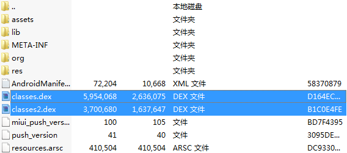

# Dalvik 可执行文件分包

## 背景

> 当您的应用及其引用的库达到特定大小时。字节码文件内的代码方法引用总数会达到上限（单个dex方法引用上限为65536=64K）

> 注意事项：64K 并不是绝对的

* 有时明明方法数达不到64K限制，安装时也会异常停止，提示dexopt failed on '/data/xxxxx'  res = 65280
* dexopt 是一个程序
* 在安装过程中系统会通过dexopt来优化dex文件
* 在优化过程中dexopt采用一个固定大小的缓冲区来存储应用中所有方法的信息
* 这个缓冲区就是LinearAlloc。
* 新版本LinearAlloc 大小时8MB/16MB
* 老版本是5MB
* 尽管没有达到64k方法数的限制，但是它的存储空间仍然有可能超出5MB，dexopt优化过程失败，也会造成安装失败

## 64K引用限制

> DEX规范将可在单个DEX文件内可引用的方法总数限制在65536
>
> 包括：android framework 方法/库方法/自己的方法

## 规避64K限制

> 您应该采取措施减少应用代码调用的引用总数，包括您的引用代码和包含的库定义的方法
>
> 1. 检查您的应用的直接和传递依赖项，不要为了使用几个实用的方法引入一个庞大的库
> 2. 通过ProGuard移除未使用的代码，apk中就不在包含未使用的方法

## 可执行文件分包支持

> 描述：默认情况下，Dalvik限制应用的每个APK只能使用单个的class.dex字节码文件
>
> 目标：一个dex文件方法引用限制为64k，可以使用多个dex文件扩展方法数限制




## 配置您的应用进行Dalvik可执行文件分包

1. 修改app/build.gradle文件启用可执行文件分包

```groovy
android {
    defaultConfig {
        ...
        minSdkVersion 15 
        targetSdkVersion 25
        multiDexEnabled true
    }
    ...
}

dependencies {
  compile 'com.android.support:multidex:1.0.1'
}
```

2. 替换或者修改Application

替换↓

```java
public class MyApplication extends MultiDexApplication { ... }
```

修改↓

```java
public class MyApplication extends SomeOtherApplication {
  @Override
  protected void attachBaseContext(Context base) {
     super.attachBaseContext(context);
     Multidex.install(this);
  }
}
```

2. 构建应用后，Android 构建工具会根据需要构建主 DEX 文件 (`classes.dex`) 和辅助 DEX 文件（`classes2.dex` 和 `classes3.dex` 等）。然后，构建系统会将所有 DEX 文件打包到您的 APK 中